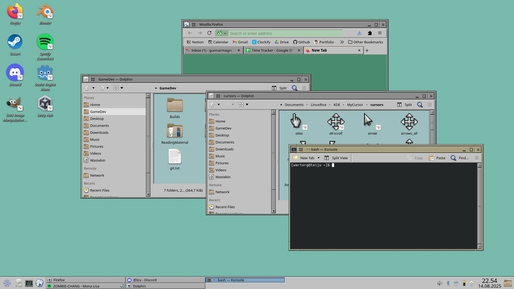

# KDE Plasma Theming


## Global Theme
I use the **Irixium** global theme made by phob1an.

[Irixium Global Theme](https://store.kde.org/p/2142966)

- Making sure to use Kvantum.
- Under `System Settings/Colours & Themes/Application Style/More Actions/Configure GNOME/GTK Application Style...` we can also enable the theme.

## Cursor
Heavily inspired and some things copied from [Padster - idTech4](https://www.deviantart.com/therealpadster/art/idTech4-X11-Mouse-Cursor-175490530)

Using [this guide](https://develop.kde.org/docs/features/cursor/)

[] TODO: Make a script to automate creating symlinks

## /Home partition
Moved /home partition to HDD. [Source](https://youtu.be/tEnnEhziLn8?si=N2dCeDq9eWljlS-4).

If I mess up the OS, I can completely reset my SSD and then link back up with my /home on the HDD.

- Find the UUID by using `lsblk -f`
- Add it to `/etc/fstab`, it should look something like `UUID=UUID=a7a71726-b1b7-49bd-bb8e-8cf7fe7a4385 /home          ext4    defaults   0 2`
- Change to tty `ctrl+alt+f4`
- Run `sudo rm -rf /home/*`. This will remove everything in the currently mounted /home folder, so be careful.
- reboot

## Tablet
The tablet out-of-the-box, but there is no way to configure it. Not so good when we have two monitors and the tablet covers both of them.
 [Source](https://forum.endeavouros.com/t/installing-huion-and-wacom-tablet-drivers-on-kde-plasma/22792).

- `yay -S wacomtablet`
- This will add the "Graphic Tablet" setting to the System Settings, however, it can't find the tablet.
- `lsusb`. This will print something like `Bus 001 Device 003: ID 056a:0302 Wacom Co., Ltd CTH-480 [Intuos Pen & Touch (S)]`, where we can see the ID.
- Go to `/etc/X11/xorg.conf.d`
- `sudo touch 50-tablet.conf` to create the file.
- Open the file and edit it. Insert the code and make sure the `MatchUSBID` field has the ID we found with `lsusb`
```
Section "InputClass"
        Identifier "Tablet"
        Driver "wacom"
        MatchDevicePath "/dev/input/event*"
        MatchUSBID "056a:0302"
EndSection
```

## Small Programs
- `inspi_terminal.sh`: runs when I open my terminal. Displays some system information and displays a random quote from my list of favorite quotes.
- `poweroff_timer.sh`: powers off the system after x amount of minutes. Usage: `./poweroff_timer <minutes>`.


## Connecting Devices
- **Bose Quiet Comfort:** It seems the Bose Quiet Comfort 35 does has issues with pairing with Bluetooth LE (Low Energy) [Source](https://askubuntu.com/questions/833322/pair-bose-quietcomfort-35-with-ubuntu-over-bluetooth). Go to `/etc/bluetooth/main.conf` and replace `#ControllerMode = dual` with `#ControllerMode = bredr` and then restart bluetooth with the terminal command `sudo systemctl restart bluetooth.service`. Hold the slide button in the on position for a few seconds to switch the headset to pairing mode and connect. Afterwards, you can enable put `dual` back, since it's just the initial pairing that has issues.
